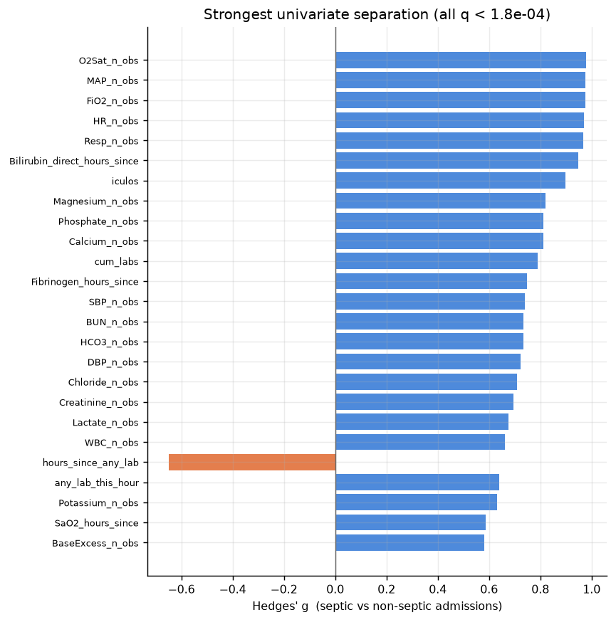
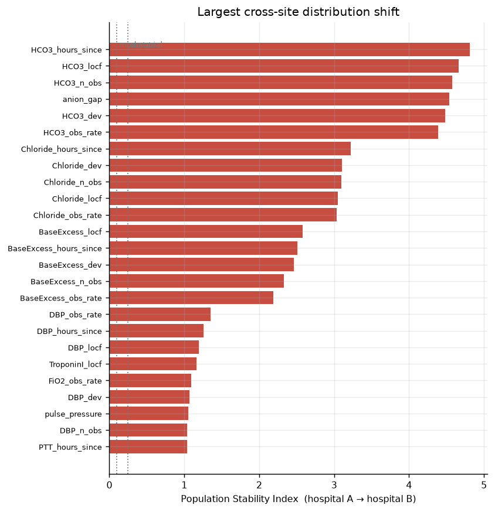
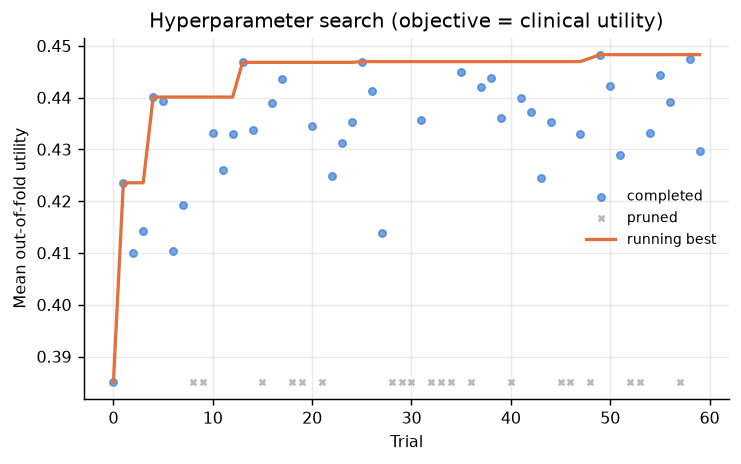
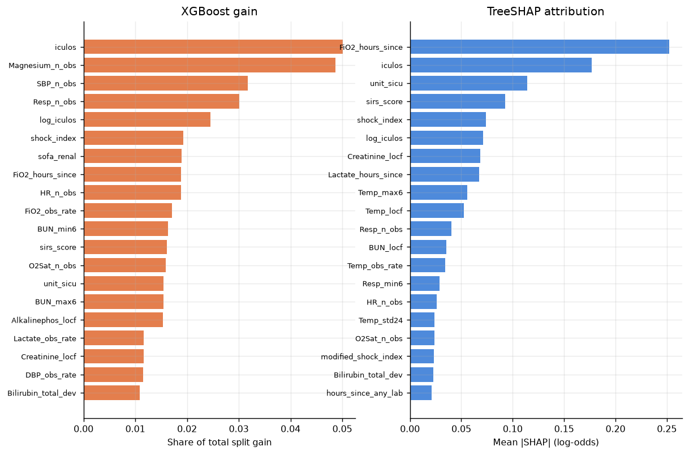
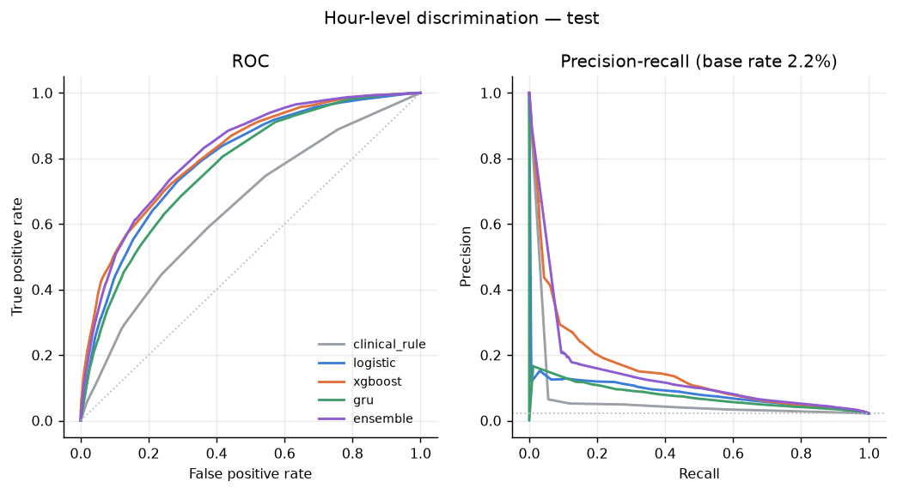
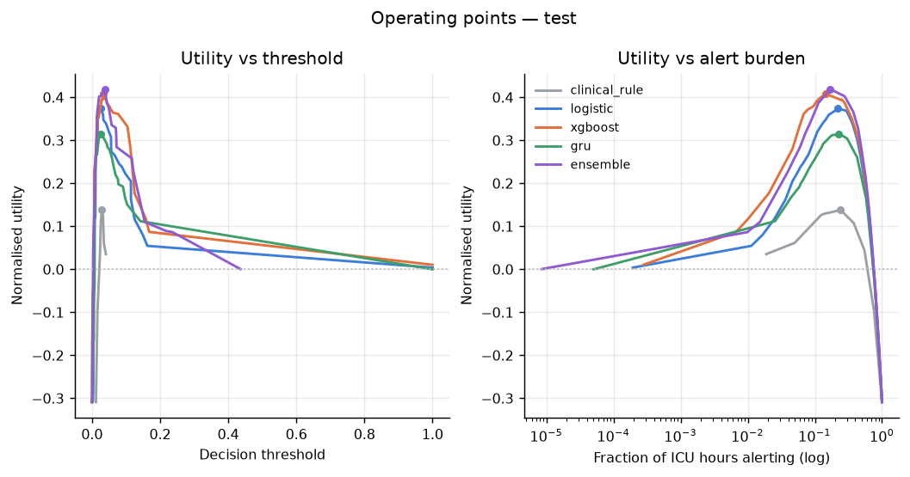
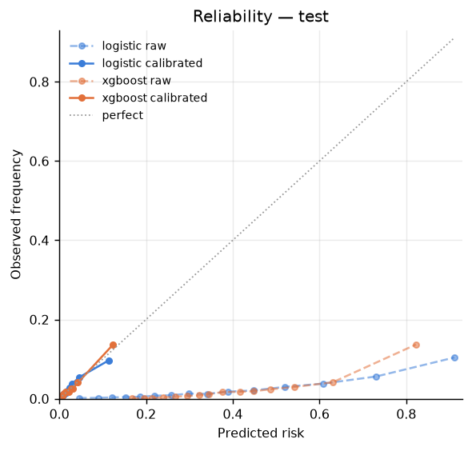
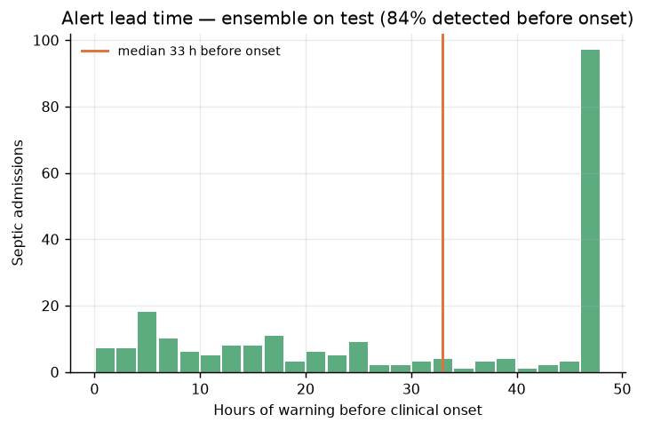
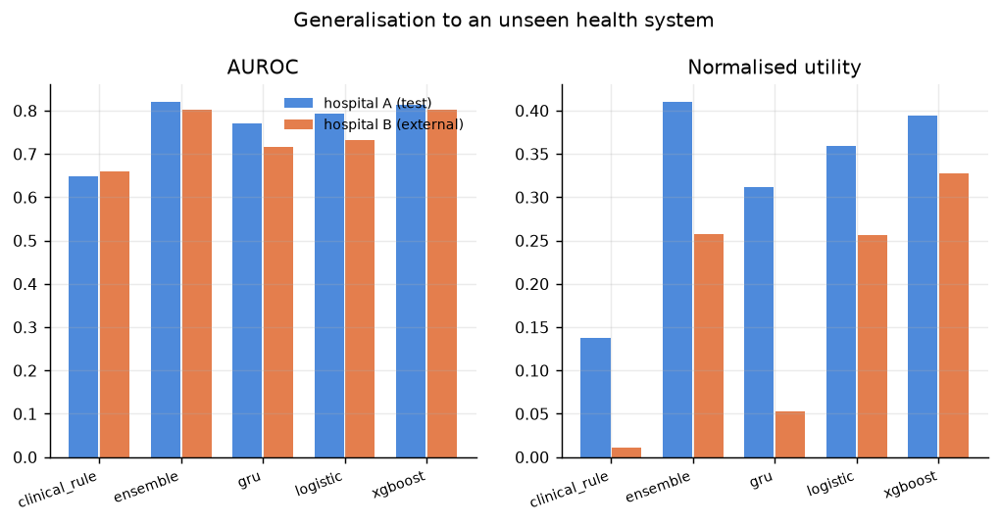

# Early Sepsis Prediction — Results

Generated by `sepsis evaluate`. Every number below comes from data the model in question never saw during fitting or tuning: hyperparameters and blend weights were selected on the validation split, the hospital A test split was scored once, and hospital B was untouched until this table.

## Cohort

| split    |   hours |   admissions |   septic_admissions |   septic_admission_rate |   positive_hour_rate |
|:---------|--------:|-------------:|--------------------:|------------------------:|---------------------:|
| train    | 551,908 |       14,234 |               1,253 |                  0.0880 |               0.0217 |
| val      | 119,222 |        3,051 |                 268 |                  0.0878 |               0.0215 |
| test     | 119,085 |        3,051 |                 269 |                  0.0882 |               0.0217 |
| external | 761,995 |       20,000 |               1,142 |                  0.0571 |               0.0141 |

## Headline results

**Hospital A — held-out test**

| model         |   auroc |   auprc |   utility |   sensitivity |   precision |   alert_rate |
|:--------------|--------:|--------:|----------:|--------------:|------------:|-------------:|
| clinical_rule |  0.6478 |  0.0371 |    0.1378 |        0.4450 |      0.0400 |       0.2416 |
| logistic      |  0.7921 |  0.0809 |    0.3594 |        0.5499 |      0.0738 |       0.1616 |
| xgboost       |  0.8135 |  0.1391 |    0.3939 |        0.6861 |      0.0610 |       0.2441 |
| gru           |  0.7702 |  0.0699 |    0.3122 |        0.5329 |      0.0633 |       0.1827 |
| ensemble      |  0.8193 |  0.1062 |    0.4096 |        0.6741 |      0.0654 |       0.2235 |

**Hospital B — external validation, never seen in any form**

| model         |   auroc |   auprc |   utility |   sensitivity |   precision |   alert_rate |
|:--------------|--------:|--------:|----------:|--------------:|------------:|-------------:|
| clinical_rule |  0.6596 |  0.0274 |    0.0110 |        0.3642 |      0.0292 |       0.1763 |
| logistic      |  0.7311 |  0.0570 |    0.2566 |        0.4465 |      0.0605 |       0.1044 |
| xgboost       |  0.8013 |  0.0693 |    0.3275 |        0.5197 |      0.0696 |       0.1057 |
| gru           |  0.7158 |  0.0280 |    0.0530 |        0.5512 |      0.0310 |       0.2519 |
| ensemble      |  0.8015 |  0.0657 |    0.2573 |        0.6343 |      0.0460 |       0.1950 |

Best model by clinical utility: **ensemble** — test AUROC 0.819 (95% CI 0.797–0.840, patient-level cluster bootstrap), normalised utility 0.410. On hospital B the same frozen model and threshold give AUROC 0.802 and utility 0.257.

### Are the differences real?

DeLong test for correlated ROC curves — the models score identical rows, so an unpaired comparison would be needlessly conservative.

| champion   | challenger    |   auc_a |   auc_b |    diff |    z |   p_value |
|:-----------|:--------------|--------:|--------:|--------:|-----:|----------:|
| ensemble   | xgboost       |   0.819 |   0.813 | 0.00587 |  5   | 5.77e-07  |
| ensemble   | logistic      |   0.819 |   0.792 | 0.0272  | 12   | 3.74e-33  |
| ensemble   | gru           |   0.819 |   0.77  | 0.0491  | 16.1 | 2.29e-58  |
| ensemble   | clinical_rule |   0.819 |   0.648 | 0.172   | 29.9 | 4.18e-196 |

### What the search actually bought

The Optuna search ran 60 trials (20 pruned) against 3-fold grouped cross-validation, reaching a best out-of-fold utility of **0.4483**. The same configuration scores **0.3939** on the held-out test split.

That +0.0544 gap is selection optimism, and it is expected: taking the maximum over 60 trials of a noisy, piecewise-constant objective selects partly for luck. It is reported rather than hidden because the CV number is the one that would be quoted if nobody had held a test set back — which is exactly why one was held back.

## What this looks like at the bedside

| model         |   detection_rate |   median_lead_time_h |   false_alarm_rate_per_admission |   false_alarms_per_true_detection |
|:--------------|-----------------:|---------------------:|---------------------------------:|----------------------------------:|
| clinical_rule |            0.829 |               36.000 |                            0.762 |                             9.502 |
| logistic      |            0.773 |               36.000 |                            0.348 |                             4.659 |
| xgboost       |            0.810 |               38.000 |                            0.425 |                             5.417 |
| gru           |            0.799 |               35.000 |                            0.426 |                             5.512 |
| ensemble      |            0.836 |               33.000 |                            0.385 |                             4.760 |

`detection_rate` counts a septic admission as caught only if the first alert lands *before* clinical onset; an alert raised after the team already suspected sepsis is not an early warning.

## Experiments

Each experiment changes exactly one thing, refits, and reports what that change was worth. Every one of them asserts its own invariants before returning, so a variant that failed to commit the mistake it was studying raises rather than publishing a plausible wrong number.

### What leakage is worth, measured

Splitting ICU hours at random instead of splitting admissions inflates AUROC by **+0.0275** (0.821 to 0.848). It is not an exotic bug: it is what `train_test_split` does to a dataframe of rows, and it puts 17,236 of 17,285 admissions on both sides of the split at once. Filling gaps from the future with a single `bfill` inflates AUROC by **+0.0056**. Everything else is held fixed across the three rows: same hyperparameters, same boosting rounds, same seed, and for variant B the same admissions in train and test as the baseline.

The more useful number is the one underneath. Clinical utility inflates by **+0.0796** and **+0.0478** for the two mistakes, roughly 3x and 9x the corresponding AUROC movement. Leakage does not merely make the ranking look better; it moves the whole risk distribution, so the threshold sweep finds an operating point that does not exist on honest data. A project reporting AUROC alone would see a fraction of the damage it is actually doing.

| variant                                   |   auroc |   auroc_inflation |   utility |   utility_inflation |   n_train_rows |   n_test_rows |
|:------------------------------------------|--------:|------------------:|----------:|--------------------:|---------------:|--------------:|
| honest (admission split, causal features) |  0.8206 |            0.0000 |    0.4148 |              0.0000 |         503767 |        167363 |
| A: split ICU hours at random              |  0.8481 |            0.0275 |    0.4944 |              0.0796 |         503347 |        167783 |
| B: fill gaps from the future (bfill)      |  0.8262 |            0.0056 |    0.4626 |              0.0478 |         503767 |        167363 |

### What each feature block buys

With all 345 features the model scores AUROC 0.8206. **No single block costs more than 0.0080 AUROC to remove** — the most expensive is `recency` (hours since each channel was last measured). Yet every block scores between 0.720 and 0.782 on its own. That combination has one explanation: the matrix is enormously redundant, and the same physiology is reachable through several different encodings of it.

The sharpest number here is the ordering-only row. Using **109 features that contain no measured value whatsoever** — only which channel was sampled, how recently, and how often — the model reaches AUROC **0.7943**, or 97% of what the full matrix achieves. Nothing about the patient's physiology is in that subset. It is a record of what the care team chose to look at, and it is nearly as predictive as the measurements themselves.

Two readings follow. The optimistic one: missingness is signal, and the recency and intensity blocks earn their place rather than padding the matrix. The uncomfortable one: a model this dependent on ordering behaviour is partly learning clinical suspicion rather than physiology, so it would degrade wherever ordering habits differ — which is exactly what the drop from hospital A to hospital B looks like.

| block     | what it is                                          |   n_features |   auroc_without |   loo_cost |   auroc_solo |   utility_without |   utility_loo_cost |
|:----------|:----------------------------------------------------|-------------:|----------------:|-----------:|-------------:|------------------:|-------------------:|
| recency   | hours since each channel was last measured          |           34 |          0.8126 |     0.0080 |       0.7599 |            0.4117 |             0.0031 |
| clinical  | SIRS, qSOFA, partial SOFA, shock index              |           40 |          0.8172 |     0.0034 |       0.7822 |            0.4179 |            -0.0031 |
| rolling   | 6h and 24h level, spread and trend                  |          128 |          0.8175 |     0.0031 |       0.7274 |            0.4194 |            -0.0047 |
| intensity | how often each channel has been sampled             |           68 |          0.8178 |     0.0028 |       0.7764 |            0.4138 |             0.0010 |
| locf      | carried-forward channel values                      |           34 |          0.8186 |     0.0020 |       0.7499 |            0.4204 |            -0.0057 |
| missing   | panel-level ordering activity                       |            7 |          0.8197 |     0.0009 |       0.7196 |            0.4158 |            -0.0011 |
| deviation | each channel against the patient's own running mean |           34 |          0.8200 |     0.0006 |       0.7365 |            0.4181 |            -0.0034 |

### Case mix or degradation: decomposing the hospital B drop

At the operating point frozen on hospital A's validation split (threshold 0.519, applied unchanged everywhere), hospital A scores 0.4243 normalised utility and hospital B scores 0.2946: a gap of **0.1297** (95% CI 0.0655 to 0.1817). Hospital B's admissions are reweighted to hospital A's baseline case mix -- demographics, unit, early vitals and first-six-hour ordering volume -- by a propensity density ratio trimmed at the 1st and 99th percentiles. That weighting cuts mean covariate imbalance from 0.220 to 0.075 |SMD| and retains an effective 53% of 20,000 admissions.

Reweighted, hospital B scores **0.3120**. So of the 0.1297 gap, **+0.0174 is case mix** (95% CI -0.0041 to +0.0419) and **+0.1123 is what remains after adjustment** (95% CI +0.0450 to +0.1724) — most of the gap survives the adjustment, and the case-mix component is not separable from zero. Both intervals come from a 200-replicate patient-level cluster bootstrap that refits the propensity model on every replicate, so the uncertainty of the reweighting is inside the interval rather than assumed away.

Two cautions on reading the second number as degradation. The adjustment can only correct for the 17 covariates it was given, so anything that differs between two health systems and is not in that list — treatment practice, labelling behaviour, unmeasured acuity — stays in the residual. And reweighting on baseline covariates does not force the septic rate to match: it moves from 5.7% to 6.7% against hospital A's 8.8%. The residual is an upper bound on degradation, not a measurement of it.

One candidate explanation can be ruled out without any modelling. The threshold is frozen at hospital A's, by design, because that is what deploying a model means, and a frozen threshold is exactly the kind of thing that stops working at a new site. Here it does not: re-picking the threshold on hospital B alone moves its utility from 0.2946 only to 0.3006, 5% of the gap. Hospital A's threshold is already very nearly the right threshold for hospital B, so the loss is in the scores themselves, not in where the line is drawn. The MICU-to-SICU experiment in the next section runs the same check across a different boundary and gets the opposite answer, which is the useful pairing: a model can cross a boundary intact while its operating point does not, and it can carry its operating point across intact and still lose most of its value.

| cohort                                  |   n_admissions |   septic_admissions_pct |   auroc |   utility |   utility_gap_vs_A |
|:----------------------------------------|---------------:|------------------------:|--------:|----------:|-------------------:|
| hospital A (test)                       |           3051 |                  8.8168 |  0.8229 |    0.4243 |             0.0000 |
| hospital B (as observed)                |          20000 |                  5.7100 |  0.7868 |    0.2946 |            -0.1297 |
| hospital B (reweighted to A's case mix) |          20000 |                  6.7276 |  0.7856 |    0.3120 |            -0.1123 |

### MICU to SICU: a shift this cohort can actually support

Trained on 2,727 medical ICU admissions and evaluated at a threshold frozen on held-out MICU patients (0.445), the model scores AUROC **0.8046** (95% CI 0.7794 to 0.8348) on MICU admissions it has not seen, and **0.7810** (0.7477 to 0.8183) on surgical ICU admissions: a drop of +0.0236, and the two intervals overlap, so discrimination is not measurably worse across the unit boundary.

Clinical utility tells a harsher story: 0.4579 at home against **0.0419** in the SICU. Most of that is not the model getting worse at ranking patients. The septic rate is 10.8% in the MICU and 4.0% in the SICU, and an alert threshold tuned where sepsis is common fires far too often where it is rare. Retuning the threshold on the SICU alone recovers +0.2573 to 0.2992 — that recovery is the price of shipping one operating point across a boundary the units do not share, and it is available in production by re-picking a threshold, without retraining.

The third bucket is the one it would be convenient to omit: 8,090 admissions where neither unit indicator was recorded — more than either named unit — scoring AUROC 0.7849 at 10.4% prevalence. Dropping them would have made the transfer claim cleaner and the cohort unrepresentative of the hospital it came from.

| cohort                               |   n_admissions |   n_hours |   septic_admissions_pct |   auroc |   auroc_lo |   auroc_hi |   utility_frozen |   utility_retuned |
|:-------------------------------------|---------------:|----------:|------------------------:|--------:|-----------:|-----------:|-----------------:|------------------:|
| MICU (held out, same unit)           |           1137 |     43417 |                 10.8179 |  0.8046 |     0.7794 |     0.8348 |           0.4579 |            0.4592 |
| SICU (surgical, the transfer target) |           4650 |    169821 |                  4.0000 |  0.7810 |     0.7477 |     0.8183 |           0.0419 |            0.2992 |
| unit not recorded                    |           8090 |    327827 |                 10.4326 |  0.7849 |     0.7727 |     0.7982 |           0.3799 |            0.3956 |

## Statistical analysis

245 of 331 features separate septic from non-septic admissions at FDR < 0.05 (Benjamini-Hochberg over Welch tests). Tests are run on one summary value per admission, not per ICU hour: hours within a stay are strongly autocorrelated, and treating them as independent inflates significance by orders of magnitude.

| feature                      |   hedges_g |   univariate_auc |   p_welch |   q_welch |
|:-----------------------------|-----------:|-----------------:|----------:|----------:|
| O2Sat_n_obs                  |     0.9781 |           0.5266 | 3.13e-37  | 8.582e-36 |
| MAP_n_obs                    |     0.9754 |           0.5236 | 1.69e-36  | 4.054e-35 |
| FiO2_n_obs                   |     0.9746 |           0.6519 | 4.809e-57 | 5.274e-55 |
| HR_n_obs                     |     0.9688 |           0.5204 | 9.27e-36  | 2.033e-34 |
| Resp_n_obs                   |     0.9686 |           0.5242 | 1.725e-36 | 4.054e-35 |
| Bilirubin_direct_hours_since |     0.9466 |           0.5827 | 9.552e-05 | 0.0001849 |
| iculos                       |     0.8987 |           0.5174 | 3.578e-34 | 6.196e-33 |
| Magnesium_n_obs              |     0.8206 |           0.6036 | 2.4e-41   | 7.896e-40 |
| Phosphate_n_obs              |     0.8111 |           0.6285 | 5.473e-51 | 3.001e-49 |
| Calcium_n_obs                |     0.8109 |           0.631  | 7.545e-51 | 3.546e-49 |
| cum_labs                     |     0.7909 |           0.5861 | 3.708e-39 | 1.109e-37 |
| Fibrinogen_hours_since       |     0.7468 |           0.5326 | 2.775e-07 | 6.968e-07 |

### Missingness is not noise

Whether a lab was *ordered* — ignoring its value entirely — separates the groups on its own. That is why the feature matrix carries recency and ordering-intensity channels rather than imputing them away.

| channel    |   order_rate_septic |   order_rate_control |   auc_of_ordering |    q_value |
|:-----------|--------------------:|---------------------:|------------------:|-----------:|
| Lactate    |           0.07606   |             0.02961  |            0.6663 | 3.868e-109 |
| BUN        |           0.1027    |             0.08088  |            0.6026 | 1.21e-32   |
| Creatinine |           0.07805   |             0.06604  |            0.5998 | 3.998e-31  |
| WBC        |           0.09103   |             0.0751   |            0.5767 | 5.388e-19  |
| PTT        |           0.0606    |             0.04715  |            0.5635 | 1.274e-13  |
| Platelets  |           0.07347   |             0.06548  |            0.5486 | 1.425e-08  |
| Fibrinogen |           0.01236   |             0.006803 |            0.5341 | 5.273e-12  |
| TroponinI  |           0.0005794 |             0.001315 |            0.4951 | 0.03014    |

### Logistic regression, interpreted

Refit without penalty on the collinearity-pruned matrix, because Wald standard errors do not apply to penalised coefficients. Odds ratios are per standard deviation of the feature.

| feature              |   odds_ratio_per_sd |   or_ci_low |   or_ci_high |   p_value |   q_value |
|:---------------------|--------------------:|------------:|-------------:|----------:|----------:|
| O2Sat_n_obs          |              1.79   |      1.653  |       1.939  | 3.362e-46 | 2.69e-44  |
| unit_sicu            |              0.6678 |      0.6263 |       0.7121 | 5.968e-35 | 2.387e-33 |
| SBP_obs_rate         |              0.7667 |      0.7342 |       0.8007 | 3.532e-33 | 9.42e-32  |
| FiO2_obs_rate        |              1.321  |      1.244  |       1.403  | 9.481e-20 | 1.896e-18 |
| hosp_adm_time        |              0.9181 |      0.895  |       0.9418 | 5.275e-11 | 8.44e-10  |
| hours_since_any_lab  |              0.8003 |      0.7462 |       0.8583 | 4.352e-10 | 5.803e-09 |
| FiO2_n_obs           |              0.8266 |      0.7704 |       0.8868 | 1.133e-07 | 1.231e-06 |
| Resp_min6            |              1.163  |      1.1    |       1.23   | 1.231e-07 | 1.231e-06 |
| FiO2_dev             |              1.08   |      1.047  |       1.115  | 1.274e-06 | 1.097e-05 |
| sirs_temp            |              1.116  |      1.067  |       1.167  | 1.371e-06 | 1.097e-05 |
| modified_shock_index |              1.16   |      1.089  |       1.235  | 4.347e-06 | 3.162e-05 |
| Lactate_n_obs        |              1.118  |      1.064  |       1.176  | 1.083e-05 | 7.22e-05  |

An elastic-net fit (L1-dominant) reduces the matrix to **45 non-zero coefficients** — a candidate short list for a bedside score.

| feature              |   coefficient |   odds_ratio_per_sd |
|:---------------------|--------------:|--------------------:|
| Resp_n_obs           |        0.2415 |              1.2732 |
| unit_sicu            |       -0.2206 |              0.8020 |
| SBP_obs_rate         |       -0.1822 |              0.8334 |
| hours_since_any_lab  |       -0.1680 |              0.8454 |
| modified_shock_index |        0.1273 |              1.1358 |
| sirs_temp            |        0.1212 |              1.1288 |
| FiO2_obs_rate        |        0.1147 |              1.1215 |
| Lactate_obs_rate     |        0.1110 |              1.1174 |
| sofa_renal           |        0.1057 |              1.1114 |
| FiO2_n_obs           |        0.0973 |              1.1022 |

## Model behaviour

### Calibration

Class weighting buys ranking quality at the cost of the probability scale. Isotonic maps were fitted on validation and are scored here on the held-out test split — reporting them on validation would be circular, since in-sample isotonic ECE is 0 by construction. Discrimination is essentially unchanged while Brier and ECE move substantially.

| model         |   brier_raw |   brier_calibrated |   ece_raw |   ece_calibrated |   auroc_raw |   auroc_calibrated |
|:--------------|------------:|-------------------:|----------:|-----------------:|------------:|-------------------:|
| clinical_rule |      0.0995 |             0.0211 |    0.2063 |           0.0037 |      0.6461 |             0.6478 |
| logistic      |      0.1787 |             0.0206 |    0.3330 |           0.0028 |      0.7929 |             0.7921 |
| xgboost       |      0.1732 |             0.0198 |    0.3631 |           0.0028 |      0.8139 |             0.8135 |
| gru           |      0.0563 |             0.0207 |    0.0920 |           0.0043 |      0.7709 |             0.7702 |

### What each model contributes

Blend weights were optimised against validation utility and then frozen. `marginal_contribution` is what the blend loses if that member is removed — a large weight with a small ablation cost means the member is redundant.

| model    |   weight |   utility_alone |   utility_without |   marginal_contribution |
|:---------|---------:|----------------:|------------------:|------------------------:|
| xgboost  |   0.6022 |          0.4017 |            0.4056 |                  0.0232 |
| logistic |   0.2556 |          0.3817 |            0.4129 |                  0.0159 |
| gru      |   0.1422 |          0.3643 |            0.4235 |                  0.0053 |

### What drives the booster

| feature             |   mean_abs_shap |
|:--------------------|----------------:|
| FiO2_hours_since    |          0.2521 |
| iculos              |          0.1769 |
| unit_sicu           |          0.1141 |
| sirs_score          |          0.0925 |
| shock_index         |          0.0740 |
| log_iculos          |          0.0711 |
| Creatinine_locf     |          0.0685 |
| Lactate_hours_since |          0.0673 |
| Temp_max6           |          0.0556 |
| Temp_locf           |          0.0525 |
| Resp_n_obs          |          0.0406 |
| BUN_locf            |          0.0352 |

### Cross-site shift

78 of 345 features shift materially (PSI > 0.25) between the two hospitals, and admission-level sepsis prevalence falls from 8.8% to 5.7%. The external column in the headline table is the cost of that shift, measured rather than assumed.

| feature              |    psi |   missing_ref |   missing_cmp |   ks_stat |
|:---------------------|-------:|--------------:|--------------:|----------:|
| HCO3_hours_since     | 4.8076 |        0.1673 |        0.9797 |    0.4002 |
| HCO3_locf            | 4.6644 |        0.1673 |        0.9797 |    0.2932 |
| HCO3_n_obs           | 4.5777 |        0.0000 |        0.0000 |    0.8124 |
| anion_gap            | 4.5351 |        0.1692 |        0.9805 |    0.1522 |
| HCO3_dev             | 4.4815 |        0.1673 |        0.9797 |    0.0722 |
| HCO3_obs_rate        | 4.3907 |        0.0000 |        0.0000 |    0.8137 |
| Chloride_hours_since | 3.2193 |        0.1676 |        0.9189 |    0.2851 |
| Chloride_dev         | 3.1072 |        0.1676 |        0.9189 |    0.0814 |
| Chloride_n_obs       | 3.0976 |        0.0000 |        0.0000 |    0.7513 |
| Chloride_locf        | 3.0463 |        0.1676 |        0.9189 |    0.0731 |

## Figures

**Univariate separation between septic and non-septic admissions, FDR-controlled.**

**Features that move most between the two hospital systems.**

**Hyperparameter search, scored on clinical utility rather than AUROC.**

**Split gain versus TreeSHAP attribution for the tuned booster.**

**ROC and precision-recall on the held-out hospital A test set.**

**Normalised utility against threshold and against alert burden.**

**Reliability before and after isotonic recalibration, on the held-out test split.**

**Hours of warning before clinical onset, for the admissions the model catches.**

**Internal test versus the unseen second hospital.**

